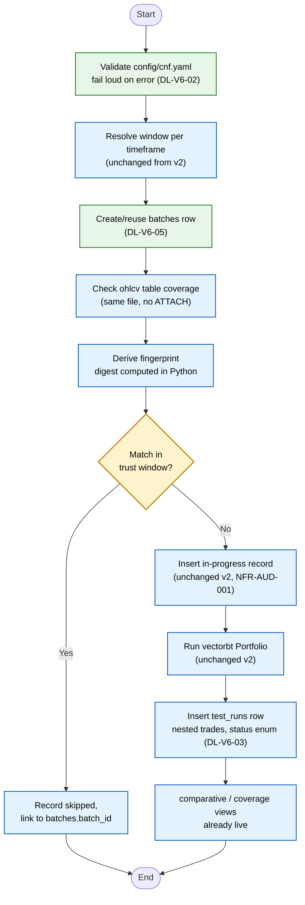

# vbSpike — v6 spec (DuckDB, single-file, hardened)

This is the working half of the v6 doc: architecture, data model, config, backup, project layout, CLI, runbook, and tests. For decision rationale, trade-offs, scope, and the risk register, see [[vbSpike-v6-decisions]].

> [!note] v6 doesn't reopen any v5 fork. It answers the follow-up questions v5 left implicit — corruption recovery, config validation, typed columns, a real `batches` table, and version pinning. See the decisions doc for why.

---

## Component map

| Component | Brief |
|---|---|
| Command Surface | `run` command, `--force`, `--max-cache-age`, `--help`, `--version` (DL-V6-08) |
| Strategy Registry & Evaluation | Unchanged — `typing.Protocol` contract, `generate_signals`, zero coupling to persistence or `vectorbt` |
| Historical Simulation | Unchanged — sole module permitted to import `vectorbt` |
| Research Integrity (fingerprinting & dedup) | Canonical scalar-ordering rule (v2 DL-N3) unchanged. Digest computed in Python (v5 DL-V5-04). `params` shape now explicitly documented (DL-V6-04) |
| Storage Layer | Owns the single DuckDB file: `ohlcv`, `test_runs`, `batches` tables, `comparative`/`coverage` views, and the backup routine (DL-V6-01) |
| Config Loader *(new)* | Validates `config/cnf.yaml` against an explicit schema at startup; fails loud on missing/malformed keys (DL-V6-02) |

Six components — the same five from v5 plus a Config Loader promoted out of "implicit behavior inside `config.py`" into something the doc actually specifies.

---

## High-level workflow

Unchanged from v5 in shape; the boundary between stages is the same. What's new is what happens around it — config is validated before anything runs, and a batch now has an actual row backing it.



---

## 1. Architecture overview

- **Style:** Unchanged — modular monolith, one deployable unit.
- **Bounded contexts:** Same five from v5, plus Config Loader as an explicit (if small) sixth — it was always code inside `config.py`, it just wasn't a named contract before.
- **What doesn't move:** Storage Layer is still the sole durable-write owner; Research Integrity still owns fingerprint logic. v6 only adds validation and typing around existing boundaries.

### Tech stack (delta from v5)

| Layer | v5 | v6 |
|---|---|---|
| Result persistence | DuckDB, single file, schema fixed | Same, DuckDB version now pinned (DL-V6-06) |
| Backup | None specified | Scheduled + pre-schema-change `COPY FROM DATABASE` snapshot (DL-V6-01) |
| Config | Read from `config/cnf.yaml`, no schema | Validated against explicit schema at startup (DL-V6-02) |
| Status/side columns | Free `TEXT` | `ENUM` (DL-V6-03) |
| Batch concept | `batch_id` column, no parent table | `batches` table, foreign-keyed (DL-V6-05) |
| Logging | Unspecified | Structured stdout lines, level from config (DL-V6-07) |

---

## 2. Data model

Three tables, two views, one file, one backup routine.

```sql
CREATE TABLE batches (
    batch_id   TEXT PRIMARY KEY,
    started_at TIMESTAMP DEFAULT now(),
    note       TEXT
);

CREATE TABLE ohlcv (
    symbol    TEXT,
    timeframe TEXT,
    ts        TIMESTAMP,
    open      DOUBLE,
    high      DOUBLE,
    low       DOUBLE,
    close     DOUBLE,
    volume    DOUBLE,
    batch_id  TEXT REFERENCES batches(batch_id),
    PRIMARY KEY (symbol, timeframe, ts)
);

CREATE TYPE run_status AS ENUM ('in_progress', 'complete', 'skipped');
CREATE TYPE trade_side AS ENUM ('buy', 'sell');

CREATE TABLE test_runs (
    fingerprint  TEXT PRIMARY KEY,
    params       JSON,
    window_start TIMESTAMP,
    window_end   TIMESTAMP,
    metrics      STRUCT(
        total_return DOUBLE,
        sharpe       DOUBLE,
        max_drawdown DOUBLE
    ),
    trades       STRUCT(
        ts    TIMESTAMP,
        side  trade_side,
        price DOUBLE,
        size  DOUBLE
    )[],
    status       run_status,
    batch_id     TEXT REFERENCES batches(batch_id),
    created_at   TIMESTAMP DEFAULT now()
);

CREATE VIEW comparative AS
    SELECT fingerprint, params, metrics, window_start, window_end
    FROM test_runs
    WHERE status = 'complete';

CREATE VIEW coverage AS
    SELECT symbol, timeframe, MIN(ts) AS earliest, MAX(ts) AS latest, COUNT(*) AS candles
    FROM ohlcv
    GROUP BY symbol, timeframe;
```

**`params` documented shape (DL-V6-04):** at minimum, `params` must contain every scalar that feeds the canonical fingerprint tuple (v2 DL-N3) — strategy name, strategy version, and each strategy parameter used by `generate_signals`. Anything else a strategy wants to log is fine to include, but these fields are load-bearing: if they're missing, the fingerprint can't be reconstructed independently of the code that produced it.

**Trade access:** `SELECT UNNEST(trades) FROM test_runs WHERE fingerprint = ?`.

**Dedup lookup:** `SELECT 1 FROM test_runs WHERE fingerprint = ?`.

**Fingerprint digest:** unchanged from v5 — Python-side, never DuckDB's internal `hash()`.

**Batches (DL-V6-05):** every `run` invocation creates or reuses a `batches` row up front; `ohlcv` ingestion and `test_runs` rows both reference it. This gives "link to batch" (referenced in the workflow since v2) an actual parent row instead of a bare ID with nothing behind it.

---

## 3. Boundary — unchanged from v5

Still one file, no `ATTACH`, no external `dataStore` process. See v5 §5 for the full rationale — nothing here changes it.

---

## 4. Constraints (delta from v5)

| Constraint | Source |
|---|---|
| All v2/v4/v5 constraints | Unchanged, not restated |
| DuckDB version pinned in `pyproject.toml` | New (DL-V6-06) — upgrades are a deliberate step (§6), not an incidental `pip upgrade` |
| Concurrent access contract stated explicitly | New (DL-V6-09) — one writer at a time; read-only queries against `comparative`/`coverage` are safe only when no write is in flight |
| `status`/`side` are enums, not free text | New (DL-V6-03) — invalid values are now a load-time error, not a silent typo |
| `config/cnf.yaml` keys are validated, not assumed | New (DL-V6-02) — see §5 |

---

## 5. Configuration schema (`config/cnf.yaml`)

New in v6 (DL-V6-02). Minimum required shape — validated at startup, app exits `1` with a clear message if any required key is missing or wrong-typed:

```yaml
vbtspike:
  duckdb_path: "/absolute/or/relative/path/to/vbtspike.duckdb"
  max_cache_age_default: "24h"
  log_level: "INFO"            # one of DEBUG, INFO, WARNING, ERROR
  backup:
    dir: "backups"
    keep_last: 5                # how many snapshots to retain before pruning
```

In this standalone monolith structure, application configuration resides at `config/cnf.yaml` within the project root. vbtspike's config loader validates the `vbtspike:` key at startup to ensure all expected parameters exist and are correctly typed.

---

## 6. Backup and recovery

New in v6 (DL-V6-01), directly closing the corruption gap named in review. DuckDB single-file databases have a documented real-world failure mode: an interrupted write (crash, OOM-kill, forced shutdown mid-ingestion) can corrupt the file with no built-in recovery.

**Snapshot command** (read-only attach, copy to a timestamped file):

```sql
ATTACH '/path/to/vbtspike.duckdb' AS live (READ_ONLY);
ATTACH '/path/to/backups/vbtspike-2026-09-05T12-00-00.duckdb' AS snap;
COPY FROM DATABASE live TO snap;
```

**When this runs:**
- On a schedule (e.g. daily, via whatever job runner is configured) — not part of this proposal to specify further.
- **Always immediately before a schema change** — the one moment a hand-written `ALTER` is most likely to go wrong.
- On demand via `vbtspike backup` (§8).

**Retention:** keep the last N snapshots (`backup.keep_last` in §5's config), pruned oldest-first. No off-machine copy in this revision — this mitigates "the file corrupted," not "the disk died."

**Recovery:** stop vbtspike, replace the live file with the most recent snapshot, restart. Anything written between that snapshot and the corruption is lost — this is a mitigation, not a zero-data-loss guarantee, which is consistent with the local-only, personal-project scope of this whole design.

---

## 7. Operator runbook (delta from v5)

- v2's runbook (batch failure handling, trust-window override behavior) is unchanged and not restated.
- **Inspecting results:** `SELECT * FROM comparative` / `SELECT * FROM coverage`.
- **Reading a trade set:** `SELECT UNNEST(trades) FROM test_runs WHERE fingerprint = ?`.
- **Schema changes:** run a backup snapshot first (§6), then hand-write the `ALTER TABLE`/rebuild script.
- **Taking a backup on demand:** see §6's snapshot command — same command runs on a schedule and before any schema change.
- **Reading logs:** stdout, one line per stage transition; set the level in `config/cnf.yaml` (§5).
- **Checking a run's exit code:** `0` success, `1` error, `2` dedup-skip (DL-V6-08) — useful if this is ever wrapped in a cron job or script.

---

## 8. CLI reference

| CLI + Flag | Example | Use Case |
|---|---|---|
| `vbtspike run` | `vbtspike run --strategy sma_cross --symbol BTCUSDT --timeframe 1h` | Standard backtest run |
| `run --force` | `vbtspike run --strategy sma_cross --symbol BTCUSDT --timeframe 1h --force` | Re-run despite an existing fingerprint in the trust window |
| `run --max-cache-age` | `vbtspike run --strategy sma_cross --symbol BTCUSDT --timeframe 1h --max-cache-age 24h` | Force refresh of stale cached data |
| `run --force --max-cache-age` | `vbtspike run --strategy sma_cross --symbol BTCUSDT --timeframe 1h --force --max-cache-age 0` | Full hard-refresh after a strategy/fingerprint change |
| `--help` | `vbtspike --help` | Show available commands and flags |
| `--version` | `vbtspike --version` | Print the installed vbtspike version |
| `backup` | `vbtspike backup` | Run an on-demand snapshot of the DuckDB file (§6) |

**Exit codes (DL-V6-08):** `0` success · `1` error (including config validation failure) · `2` dedup-skip (ran successfully but the fingerprint already existed in the trust window).

`--strategy`, `--symbol`, and `--timeframe` are still inferred from the Strategy Registry and window-resolution behavior — confirm exact flag names against the implementation.

---

## 9. Project layout (standalone monolith)

Monolith repository root structure with top-level `config/`, `strategies/`, `src/` layout, a `backups/` directory for local snapshot output, and internal `config/` module for validation.

```
vbtSpike-4/
├── config/
│   └── cnf.yaml
│
├── strategies/
│   ├── __init__.py
│   ├── base.py
│   ├── sma_cross.py
│   └── registry.py
│
├── src/
│   └── vbtspike/
│       ├── __init__.py
│       ├── cli.py
│       │
│       ├── config/
│       │   ├── __init__.py
│       │   ├── schema.py
│       │   └── loader.py
│       │
│       ├── simulation/
│       │   ├── __init__.py
│       │   └── runner.py
│       │
│       ├── integrity/
│       │   ├── __init__.py
│       │   ├── canonical.py
│       │   └── fingerprint.py
│       │
│       └── storage/
│           ├── __init__.py
│           ├── db.py
│           ├── schema.sql
│           ├── views.sql
│           ├── ingest.py
│           ├── writer.py
│           └── backup.py
│
├── migrations/
│   ├── 0001_init.sql
│   └── README.md
│
├── backups/
│   └── .gitkeep
│
├── tests/
│   ├── test_fingerprint.py
│   ├── test_storage.py
│   ├── test_views.py
│   ├── test_config.py
│   ├── test_backup.py
│   ├── test_cli.py
│   └── fixtures/
│       └── sample.duckdb
│
├── Docs/
│   ├── vbSpike-brif.md
│   ├── vbSpike-v4-duckdb-brief.md
│   ├── proposal.md
│   ├── vbSpike-v6-spec.md
│   └── vbSpike-v6-decisions.md
│
├── pyproject.toml
└── README.md
```

`backups/` is local-only and should be gitignored except for the placeholder — it holds on-disk snapshots, not source-controlled state. `src/vbtspike/config/schema.py` is the explicit contract for what `config/cnf.yaml` must contain (§5); `storage/backup.py` implements the snapshot command (§6).

---

## 10. Testing strategy (delta from v5)

Unchanged from v5, plus:

- A test asserting `config/cnf.yaml` validation rejects a missing required key and a wrong-typed value, and accepts a minimal valid file.
- A test asserting an invalid `status` or `side` value is rejected at insert time (enum constraint working as intended).
- A test asserting a `test_runs` insert without a matching `batches` row fails (foreign key working as intended).
- A test asserting the backup snapshot command produces a file that can be reopened and queried (backup routine actually restores, not just runs).
- A test asserting `--help` and `--version` exit `0` and produce output (basic CLI smoke test).
