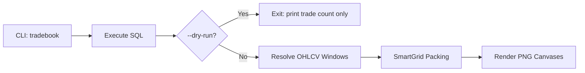
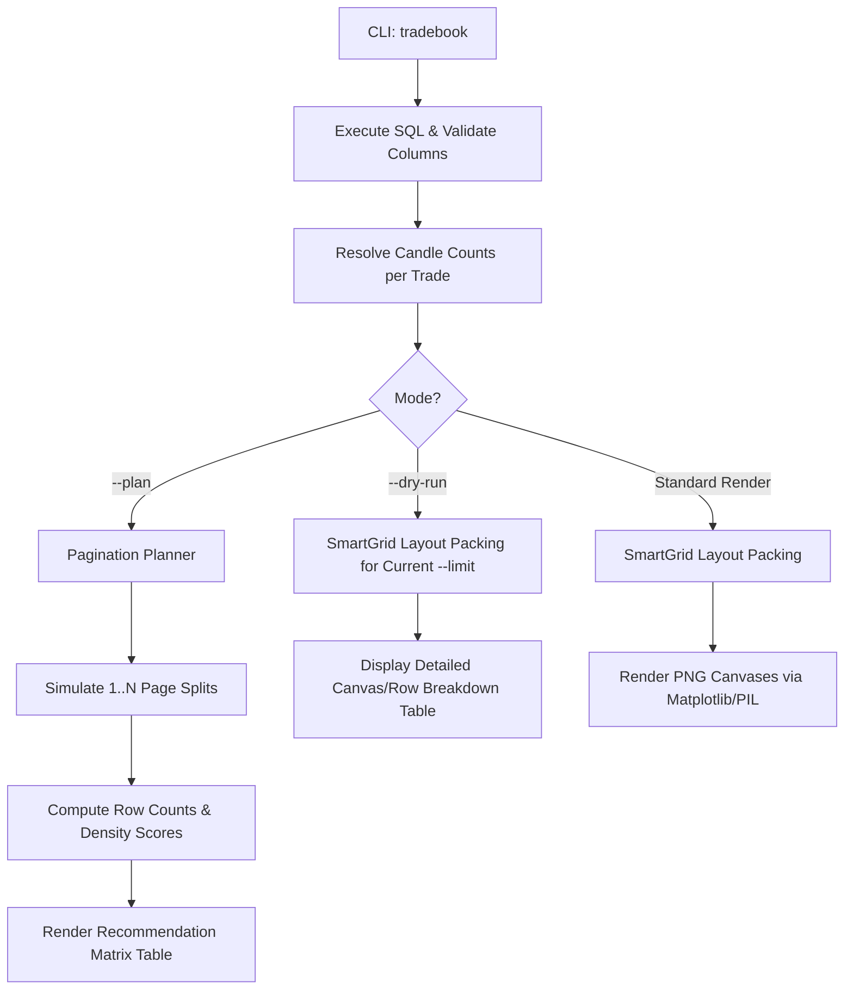

# PLAN: TradeBook Pre-Flight Layout Planning Matrix & Enhanced Dry-Run

**Document ID**: `PLAN-tradebook-pagination-matrix-dryrun.md`  
**Location**: `DOCs/Artifacts/PLans/`  
**Target Package**: `Core/trade_book_charts/`  
**Status**: DRAFT / PROPOSED (No package code modified)  
**Date**: 2026-09-07  

---

## 1. Executive Summary & Problem Statement

### The Problem
Currently, executing `uv run trade-book-charts tradebook ... --dry-run` performs a minimal check:
1. It validates the DuckDB connection and executes the `--sql` trade query.
2. It immediately terminates after counting rows:
   ```text
   [dry-run] 26 trade(s) would be plotted
   Done: 26 trade(s), 0 canvas(es), 0 PNG(s) written.
   ```
3. It **does not** fetch candle window sizes, **does not** execute the SmartGrid layout packing algorithm, and **does not** provide any information about:
   - How many pages will be created.
   - How many charts will be placed on each page.
   - How many rows will be rendered per canvas.
   - Whether the chosen `--limit` produces an unbalanced "orphan" page (e.g., `--limit 12` on 26 trades yields 12, 12, and 2 charts).

### The Solution
Introduce a **Pre-Flight Planning & Layout Matrix** feature (`--plan`) and an **Enhanced Dry-Run** mode that:
1. Computes the exact candle durations for all selected trades in milliseconds (without importing `matplotlib`, `mplfinance`, or rendering PNGs).
2. Simulates multiple pagination configurations ($K = 1, 2, 3, \dots$ pages).
3. Evaluates layout quality, row packing, and visual density.
4. Emits a clean, borderless recommendation matrix in stdio (or JSON for automated workflows) showing the user/agent optimal options to select before triggering expensive image rendering.

---

## 2. Architecture & Design Specification

### Current Workflow


### Proposed Workflow


---

## 3. Detailed Component Specifications

### 3.1 Component A: Enhanced `--dry-run` Output
When running `--dry-run`, instead of returning 0 canvases, execute `SmartGridEngine` with the active `--limit` and print a structured layout inspection table:

```text
SMARTGRID DRY-RUN LAYOUT BREAKDOWN (Total Trades: 26 | Limit: 12)

Canvas   Charts   Trades Covered         Rows   Charts / Row   Avg Candles / Chart
-----------------------------------------------------------------------------------
Page 1   12       #1 — #12 (12 trades)    3     4, 4, 4        28.4 candles
Page 2   12       #13 — #24 (12 trades)   3     4, 4, 4        31.2 candles
Page 3    2       #25 — #26 (2 trades)    1     2              25.0 candles ⚠️ ORPHAN

Summary: 3 Canvases would be generated. Warning: Page 3 contains only 2 charts.
Recommendation: Consider --limit 13 for 2 balanced pages of 13 charts each.
```

### 3.2 Component B: Pre-Flight Pagination Matrix (`--plan`)
When running `--plan`, the tool evaluates candidate page counts and presents a comparison matrix:

#### Matrix Table Layout:
```text
PAGINATION & LAYOUT PLANNING MATRIX (Total Trades Found: 26)

Pages   Distribution   Rows / Page   Density / Readability    Balance Score   Recommendation
--------------------------------------------------------------------------------------------
  1     26             5 - 6 rows    Dense (4-5 charts/row)   100%            Crowded
  2     13, 13         3 - 4 rows    Optimal (3-4 charts/row) 100%            ⭐️ RECOMMENDED
  3     9, 9, 8        2 - 3 rows    Spacious & Readable       96%            Good for detail
  4     7, 7, 6, 6     2 rows        Sparse                    92%            Too many pages
```

#### Scoring & Recommendation Heuristics:
1. **Balance Score**: Measures variance in trades per page:
   $$\text{Balance} = 1.0 - \frac{\text{Max Trades} - \text{Min Trades}}{\text{Average Trades}}$$
2. **Orphan Penalty**: Flags any configuration where the final page has $\le 2$ charts while preceding pages have $\ge 8$.
3. **Ideal Density Range**: 8 to 14 charts per canvas page (typically 2 to 3 rows of 3 to 4 charts each).
4. **Recommended Pick**: Selects the configuration with the highest balance score within the ideal density range.

### 3.3 Component C: Machine-Readable JSON Envelope (`--plan --json`)
For programmatic consumption by agents or automated scripts:
```json
{
  "status": "ok",
  "command": "plan",
  "trades_found": 26,
  "recommendation": {
    "recommended_limit": 13,
    "pages": 2,
    "distribution": [13, 13],
    "rationale": "Evenly balances 26 trades across 2 pages with 3-4 charts per row."
  },
  "options": [
    {
      "pages": 1,
      "distribution": [26],
      "avg_rows": 6,
      "density": "dense",
      "orphan_charts": 0
    },
    {
      "pages": 2,
      "distribution": [13, 13],
      "avg_rows": 3,
      "density": "optimal",
      "orphan_charts": 0
    },
    {
      "pages": 3,
      "distribution": [9, 9, 8],
      "avg_rows": 2,
      "density": "spacious",
      "orphan_charts": 0
    }
  ]
}
```

---

## 4. Implementation Steps (Zero Collateral Impact)

All proposed changes are strictly isolated to `Core/trade_book_charts/`:

| Step | Target File | Proposed Change |
| :--- | :--- | :--- |
| **1. Window Sizing Decoupling** | `Core/trade_book_charts/db.py` | Add lightweight `fetch_candle_counts_only(...)` that queries candle window counts in DuckDB using `COUNT(*)` per trade window without loading full OHLCV DataFrames into memory. |
| **2. Pagination Planner Logic** | `Core/trade_book_charts/engine.py` | Add `class PaginationPlanner` that computes balanced integer partitions ($N$ items across $K$ bins) and runs `SmartGridEngine` on candidates. |
| **3. CLI Flags & Routing** | `Core/trade_book_charts/cli.py` | Add `--plan` flag to `tradebook` parser. Wire `--plan` and enhanced `--dry-run` dispatchers. |
| **4. Table Display Formatter** | `Core/trade_book_charts/renderer.py` | Add rich borderless table formatter (`box=None` per `Shared/cnf.yaml`) for terminal rendering. |
| **5. Regression Verification** | `Tests/` | Add test cases verifying existing `tradebook` and `smartgrid` behavior remains 100% backward-compatible. |

---

## 5. Summary & Next Actions

- **Current Status**: Plan is fully documented and saved in `DOCs/Artifacts/PLans/PLAN-tradebook-pagination-matrix-dryrun.md`.
- **Package Status**: **No code in `Core/trade_book_charts/` has been modified.**
- **Next Step**: When approved by the user, the proposed implementation steps can be executed sequentially with comprehensive test validation.
