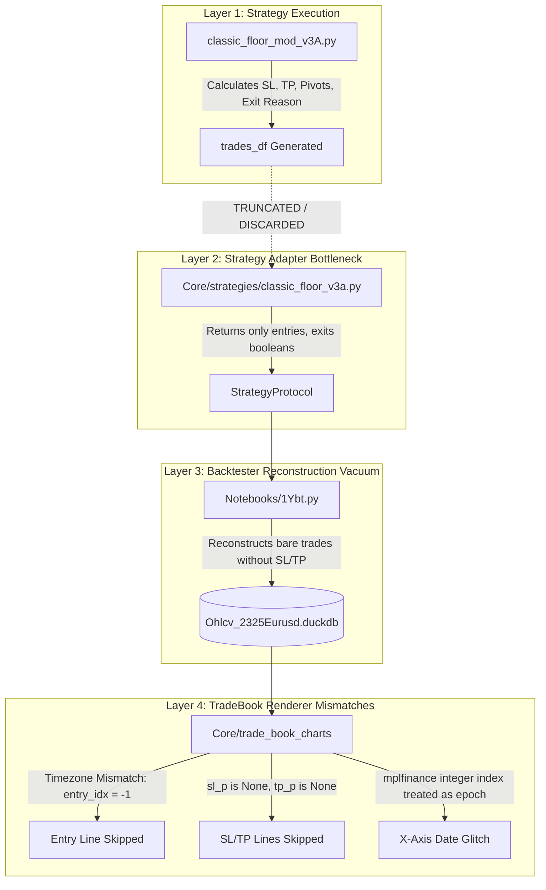

# PROB-03: Strategy Trade Risk Architecture Disconnect & TradeBook Rendering Failures

**Document ID**: `prob-03.md`  
**Location**: `DOCs/`  
**Date**: 2026-09-07  
**Status**: INVESTIGATED & SOLVED (Awaiting Execution)  
**Related Components**:
- Strategy: [`Shared/straragYs/classic_floor_mod_v3A.py`](file:///home/avijit/workSpace/Code/ta-patterns-book/Shared/straragYs/classic_floor_mod_v3A.py), [`Shared/straragYs/classic_floor_mod_v2.py`](file:///home/avijit/workSpace/Code/ta-patterns-book/Shared/straragYs/classic_floor_mod_v2.py)
- Adapter: [`Core/strategies/classic_floor_v3a.py`](file:///home/avijit/workSpace/Code/ta-patterns-book/Core/strategies/classic_floor_v3a.py), [`Core/strategies/registry.py`](file:///home/avijit/workSpace/Code/ta-patterns-book/Core/strategies/registry.py)
- Backtester: [`Notebooks/1Ybt.py`](file:///home/avijit/workSpace/Code/ta-patterns-book/Notebooks/1Ybt.py)
- Database: [`Shared/INPs/Ohlcv_2325Eurusd.duckdb`](file:///home/avijit/workSpace/Code/ta-patterns-book/Shared/INPs/Ohlcv_2325Eurusd.duckdb)
- Schema Standard: [`Core/vbt-spike-lite-4.1/Shared/test-schema.json`](file:///home/avijit/workSpace/Code/ta-patterns-book/Core/vbt-spike-lite-4.1/Shared/test-schema.json)
- Visualization: [`Core/trade_book_charts/`](file:///home/avijit/workSpace/Code/ta-patterns-book/Core/trade_book_charts/)

---

## 1. Problem Statement

When visualizing backtested trades using `trade-book-charts` and profiling strategy performance via `loss-profile`, the workflow suffers from critical visual and analytical deficiencies:

### 1.1 Visual Deficiencies on Chart Canvases
1. **Stop Loss (SL) Line Missing**: No red horizontal stop line is drawn on the charts.
2. **Take Profit (TP) Line Missing**: No green horizontal target line is drawn on the charts.
3. **Entry Marker Missing**: The blue vertical dashed line (entry bar) and blue dotted horizontal line (entry price) are completely absent.
4. **Signal & Setup Candles Invisible**: In delayed entry strategies (e.g. `classic_floor_mod_v3a`, which enters 3 or 6 candles after the signal), neither the signal trigger bar nor the intermediate wait candles are indicated.
5. **Exit Reason Fallback**: The chart title displays generic `'Exit: PROVIDED'` or `'Exit: Closed'` instead of distinguishing whether the trade was stopped out (`SL`) or hit target (`TP`).
6. **X-Axis Date Labeling Distortion**: In `mplfinance` canvases, x-axis ticks display `01-01 00:00`, `01-11 00:00`, `01-21 00:00` regardless of the actual trade date, because a matplotlib date formatter is incorrectly applied to integer candle indices.

### 1.2 Analytical Deficiencies in `loss-profile`
- Running `loss-profile --primary --view classic_floor_mod_v3a_trades --dist prr` fails to compute Projected Risk-to-Reward distribution brackets because `projected_rr` (and underlying `sl_price`/`tp_price`) is absent from the primary database view.

### 1.3 Schema Non-Compliance
- The primary database view `classic_floor_mod_v3a_trades` deviates from:
  - The historical baseline database (`Shared/Data/eur_usd_trades_5m.duckdb`), which contains `uid`, `trade_id`, `sl_price`, `tp_price`, `exit_reason`, `pivot`, `s1`, `r1`, and `duration_candel`.
  - The project contract specification in [`test-schema.json`](file:///home/avijit/workSpace/Core/vbt-spike-lite-4.1/Shared/test-schema.json), which mandates `trade_id`, `exit_reason` (`TP`, `SL`, `SIGNAL`, `TIME`), `risk_amount`, `r_multiple`, MFE, and MAE metrics.

---

## 2. Root Cause Analysis

A rigorous audit of the execution chain reveals **four distinct root causes** across different layers:



### Root Cause 1: The Adapter Information Bottleneck
The core strategy [`Shared/straragYs/classic_floor_mod_v3A.py`](file:///home/avijit/workSpace/Code/ta-patterns-book/Shared/straragYs/classic_floor_mod_v3A.py#L214-L235) **already computes all required risk and price levels**:
```python
trades_df['pivot'] = pivot.values
trades_df['s1'] = s1.values
trades_df['r1'] = r1.values
trades_df['sl_price'] = sl_series
trades_df['tp_price'] = tp_series
trades_df['exit_reason'] = exit_reason_series  # "TP" or "SL"
return entries, exits, trades_df
```
However, the adapter [`Core/strategies/classic_floor_v3a.py:51`](file:///home/avijit/workSpace/Code/ta-patterns-book/Core/strategies/classic_floor_v3a.py#L51) explicitly discarded `trades_df`:
```python
entries, exits, _trades_df = self._inner.generate_signals(ohlcv, params=params)
return entries, exits  # <--- trades_df was thrown away!
```

### Root Cause 2: Backtester Schema Deprivation
Because [`Notebooks/1Ybt.py`](file:///home/avijit/workSpace/Code/ta-patterns-book/Notebooks/1Ybt.py#L145-L166) only received boolean `entries` and `exits` Series, `simulate_signals()` had to reconstruct trade executions in a vacuum using a standard close-price loop. Consequently, it populated only generic trade timestamps and PnL, leaving `sl_price`, `tp_price`, `exit_reason`, and Floor Pivot columns completely empty.

### Root Cause 3: Timezone Awareness Mismatch in TradeBook
In [`Core/trade_book_charts/db.py:107-111`](file:///home/avijit/workSpace/Code/ta-patterns-book/Core/trade_book_charts/db.py#L107-L111):
- `_to_naive_ts()` calls `ts.tz_localize(None)` on the trade's `entry_time`, stripping its timezone and making it timezone-naive.
- The DuckDB 5-minute view `ohlcv_eurusd_5m_2025` returns timestamps that are **timezone-aware** (`Asia/Calcutta` / `+05:30`).
- In [`Core/trade_book_charts/renderer.py:216`](file:///home/avijit/workSpace/Code/ta-patterns-book/Core/trade_book_charts/renderer.py#L216):
  ```python
  entry_idx_arr = x_dates.get_indexer([entry_dt])
  ```
  Pandas cannot match a timezone-naive timestamp against a timezone-aware index, returning **`entry_idx = -1`**.
- Line 217 checks `if entry_idx_arr[0] != -1:`. Since it evaluated to `False`, the blue vertical entry line and blue horizontal entry price line were **silently skipped**.

### Root Cause 4: Matplotlib Formatter on Category Axis
`mplfinance` subplots use integer bar coordinates ($0, 1, 2, \dots, N-1$) along the x-axis rather than datetime floats. Applying:
```python
ax.xaxis.set_major_formatter(mdates.DateFormatter("%m-%d %H:%M"))
```
causes matplotlib to treat integers $0..31$ as days since the UNIX epoch (1970-01-01), causing all charts to display ticks between `01-01 00:00` and `01-31 00:00`.

---

## 3. Solution Approach

To permanently resolve these issues without breaking existing workflows, the solution is organized into four clean, decoupled pillars:


### Pillar 1: Preserve Rich Strategy Data in Adapters
- Update [`Core/strategies/classic_floor_v3a.py`](file:///home/avijit/workSpace/Code/ta-patterns-book/Core/strategies/classic_floor_v3a.py) (and `classic_floor_v3.py` / `classic_floor_v2.py`):
  - Retain `trades_df` on the strategy instance:
    ```python
    self.last_trades_df = _trades_df
    ```
  - Provide an accessor `get_last_trades_df()` or return it directly when requested by advanced runners.

### Pillar 2: Enrich Primary Backtest Views (`test-schema.json` Compliance)
- Update [`Notebooks/1Ybt.py`](file:///home/avijit/workSpace/Code/ta-patterns-book/Notebooks/1Ybt.py):
  1. Retrieve `last_trades_df` from the strategy after signal generation.
  2. For each completed trade in `simulate_signals()`, join the matching record to attach:
     - `sl_price` (Float)
     - `tp_price` (Float)
     - `exit_reason` (String: `'TP'`, `'SL'`)
     - `pivot`, `s1`, `r1` (Floats)
     - `signal_time` (Timestamp of original trigger bar)
  3. Derive computed risk fields matching [`test-schema.json`](file:///home/avijit/workSpace/Code/ta-patterns-book/Core/vbt-spike-lite-4.1/Shared/test-schema.json):
     - `trade_id = vbt_trade_id`
     - `risk_amount = abs(entry_price - sl_price) * size`
     - `r_multiple = pnl / risk_amount`
     - `projected_rr = abs(tp_price - entry_price) / abs(entry_price - sl_price)`
  4. Save the enriched dataset into `classic_floor_mod_v3a_trades` and `classic_floor_mod_v3_trades` in [`Shared/INPs/Ohlcv_2325Eurusd.duckdb`](file:///home/avijit/workSpace/Code/ta-patterns-book/Shared/INPs/Ohlcv_2325Eurusd.duckdb).

### Pillar 3: Fix Timezone Matching & X-Axis Formatting in `trade_book_charts`
- In [`Core/trade_book_charts/renderer.py`](file:///home/avijit/workSpace/Code/ta-patterns-book/Core/trade_book_charts/renderer.py) and [`db.py`](file:///home/avijit/workSpace/Code/ta-patterns-book/Core/trade_book_charts/db.py):
  1. **Timezone Alignment**:
     Align timestamp timezones before index lookup:
     ```python
     if x_dates.tz is not None and entry_dt.tzinfo is None:
         entry_dt = entry_dt.tz_localize(x_dates.tz)
     elif x_dates.tz is None and entry_dt.tzinfo is not None:
         entry_dt = entry_dt.tz_localize(None)
     entry_idx_arr = x_dates.get_indexer([entry_dt])
     ```
     This guarantees `entry_idx != -1`, restoring the blue dashed vertical entry bar and dotted entry price line.
  2. **X-Axis Ticks**:
     Format x-axis tick positions using real dates from `x_dates[tick_indices]` rather than applying `mdates.DateFormatter` directly to integer coordinates.

### Pillar 4: Signal & Delay Candle Visualization
- Enhance `trade_book_charts/renderer.py`:
  - If `--sql` includes `signal_time`, resolve `signal_idx = x_dates.get_indexer([signal_dt])[0]`.
  - Draw an amber dashed line at `signal_idx` labeled `'SIGNAL'`.
  - Add a light golden background span between `signal_idx` and `entry_idx`:
    ```python
    ax.axvspan(signal_idx, entry_idx, color="#ffecb3", alpha=0.35, label="Wait Setup")
    ```
  - This allows instant visual identification of the 3-setup candles (`entry_1`) and delay candles before trade entry.

---

## 4. Verification Checklist

| Verification Step | Command | Expected Result |
| :--- | :--- | :--- |
| **1. Database Schema** | `DESCRIBE classic_floor_mod_v3a_trades` | Contains `sl_price`, `tp_price`, `exit_reason`, `pivot`, `s1`, `r1`, `risk_amount`, `r_multiple` |
| **2. Loss Profiler R:R** | `uv run loss-profile --primary --view classic_floor_mod_v3a_trades --dist prr` | Emits valid R:R bracket distribution table |
| **3. TradeBook Visuals** | `uv run trade-book-charts tradebook ...` | Rendered PNGs show: <br>• Red SL line <br>• Green TP line <br>• Blue Entry line <br>• Correct timestamps on X-axis <br>• Shaded Signal-to-Entry window |
